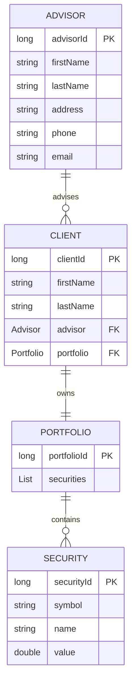

# Wells Fargo JPA Counselor Application

A Spring Boot starter project for Task 2 of Forage's Wells Fargo Software Engineering Program. The project models the core domain for a financial counselor application using Jakarta Persistence API (JPA) entities.

The current codebase focuses on the persistence model: advisors, clients, portfolios, and securities. It is intentionally lightweight and ready to be extended with repositories, services, controllers, configuration, and tests.

## Table of Contents

- [Project Overview](#project-overview)
- [Tech Stack](#tech-stack)
- [Repository Structure](#repository-structure)
- [Domain Model](#domain-model)
- [Entity Details](#entity-details)
- [Application Entrypoint](#application-entrypoint)
- [Prerequisites](#prerequisites)
- [Setup](#setup)
- [Build and Run](#build-and-run)
- [Database Notes](#database-notes)
- [Development Workflow](#development-workflow)
- [Suggested Next Steps](#suggested-next-steps)
- [Troubleshooting](#troubleshooting)
- [License and Attribution](#license-and-attribution)

## Project Overview

This application is named `wells-fargo-task-2` in Maven and uses the package namespace `com.wellsfargo.counselor`.

The project defines a simple financial advisory domain:

- An `Advisor` represents a financial advisor with contact information.
- A `Client` represents a customer assigned to an advisor.
- A `Portfolio` represents the collection of securities owned by a client.
- A `Security` represents an individual investment asset inside a portfolio.

At this stage, the project does not expose REST endpoints or implement business logic. The main deliverable is the JPA entity layer that can be used as the foundation for a complete Spring Boot application.

## Tech Stack

| Area | Technology |
| --- | --- |
| Language | Java 19 |
| Framework | Spring Boot 3.0.4 |
| Persistence | Spring Data JPA |
| JPA API | Jakarta Persistence |
| Web Support | Spring Boot Starter Web |
| Runtime Database Dependency | H2 Database |
| Build Tool | Maven |
| Maven Wrapper | Included through `mvnw` and `mvnw.cmd` |

## Repository Structure

```text
.
|-- .mvn/
|-- src/
|   `-- main/
|       `-- java/
|           `-- com/
|               `-- wellsfargo/
|                   `-- counselor/
|                       |-- Entrypoint.java
|                       `-- entity/
|                           |-- Advisor.java
|                           |-- Client.java
|                           |-- Portfolio.java
|                           `-- Security.java
|-- .gitignore
|-- mvnw
|-- mvnw.cmd
|-- pom.xml
`-- README.md
```

## Domain Model

The entity relationships are:

- One advisor can be associated with many clients.
- Each client is associated with one advisor.
- Each client has one portfolio.
- Each portfolio contains many securities.



## Entity Details

### Advisor

Location: `src/main/java/com/wellsfargo/counselor/entity/Advisor.java`

`Advisor` is a JPA entity representing a financial advisor.

Fields:

| Field | Type | JPA Notes |
| --- | --- | --- |
| `advisorId` | `long` | Primary key, generated value |
| `firstName` | `String` | Required column |
| `lastName` | `String` | Required column |
| `address` | `String` | Required column |
| `phone` | `String` | Required column |
| `email` | `String` | Required column |

Important implementation details:

- Annotated with `@Entity`.
- Uses `@Id` and `@GeneratedValue` for the primary key.
- Provides a protected no-argument constructor required by JPA.
- Provides a public constructor for creating initialized advisor instances.
- Provides getters and setters for mutable fields.

### Client

Location: `src/main/java/com/wellsfargo/counselor/entity/Client.java`

`Client` is a JPA entity representing a customer in the advisory system.

Fields:

| Field | Type | JPA Notes |
| --- | --- | --- |
| `clientId` | `long` | Primary key, generated value |
| `firstName` | `String` | Required column |
| `lastName` | `String` | Required column |
| `advisor` | `Advisor` | Many clients can reference one advisor |
| `portfolio` | `Portfolio` | One client references one portfolio |

Important implementation details:

- Annotated with `@Entity`.
- Uses `@ManyToOne` for the advisor relationship.
- Uses `@OneToOne` for the portfolio relationship.
- Keeps the no-argument constructor protected for JPA.
- Provides a public constructor that accepts the client name, advisor, and portfolio.

### Portfolio

Location: `src/main/java/com/wellsfargo/counselor/entity/Portfolio.java`

`Portfolio` is a JPA entity representing a client's collection of investments.

Fields:

| Field | Type | JPA Notes |
| --- | --- | --- |
| `portfolioId` | `long` | Primary key, generated value |
| `securities` | `List<Security>` | One portfolio can reference many securities |

Important implementation details:

- Annotated with `@Entity`.
- Uses `@OneToMany` for the securities relationship.
- Stores securities in a Java `List`.
- Provides a protected no-argument constructor for JPA.

### Security

Location: `src/main/java/com/wellsfargo/counselor/entity/Security.java`

`Security` is a JPA entity representing a single investment asset.

Fields:

| Field | Type | JPA Notes |
| --- | --- | --- |
| `securityId` | `long` | Primary key, generated value |
| `symbol` | `String` | Required column |
| `name` | `String` | Required column |
| `value` | `double` | Required column |

Important implementation details:

- Annotated with `@Entity`.
- Uses a generated primary key.
- Requires symbol, name, and value to be non-null at the database column level.
- Uses `double` for value in the starter implementation.

## Application Entrypoint

Location: `src/main/java/com/wellsfargo/counselor/Entrypoint.java`

The `Entrypoint` class starts the Spring Boot application:

```java
SpringApplication.run(Entrypoint.class, args);
```

The application currently excludes automatic datasource configuration:

```java
@SpringBootApplication(exclude = {DataSourceAutoConfiguration.class})
```

This means Spring Boot will start without requiring a configured database connection. That is helpful for a starter project, but it also means JPA repositories and real persistence will need database configuration before they can be used in a complete application.

## Prerequisites

Install the following before working with the project:

- Java 19 or a compatible JDK configured on your `PATH`.
- Git, if you plan to clone or version the project.
- No separate Maven installation is required because the Maven Wrapper is included.

Check Java:

```bash
java --version
```

## Setup

Clone the repository:

```bash
git clone <repository-url>
cd wells-fargo-JPA
```

On Windows, use the Maven Wrapper command:

```bash
.\mvnw.cmd clean install
```

On macOS or Linux, use:

```bash
./mvnw clean install
```

## Build and Run

Build the project:

```bash
.\mvnw.cmd clean package
```

Run the application on Windows:

```bash
.\mvnw.cmd spring-boot:run
```

Run the application on macOS or Linux:

```bash
./mvnw spring-boot:run
```

Because there are no controllers yet, starting the application does not expose application-specific HTTP endpoints. The app currently serves as a Spring Boot shell around the entity model.

## Database Notes

The project includes H2 as a runtime dependency:

```xml
<dependency>
    <groupId>com.h2database</groupId>
    <artifactId>h2</artifactId>
    <scope>runtime</scope>
</dependency>
```

However, `DataSourceAutoConfiguration` is excluded in the application entrypoint. As a result:

- Spring Boot will not automatically create a datasource.
- H2 is available as a dependency, but not actively configured.
- No `application.properties` or `application.yml` file is currently present.
- Repositories are not yet defined.
- Schema generation is not currently configured.

To enable persistence later, remove the datasource auto-configuration exclusion and add datasource settings such as:

```properties
spring.datasource.url=jdbc:h2:mem:counselordb
spring.datasource.driverClassName=org.h2.Driver
spring.datasource.username=sa
spring.datasource.password=
spring.jpa.database-platform=org.hibernate.dialect.H2Dialect
spring.jpa.hibernate.ddl-auto=update
spring.h2.console.enabled=true
```

## Development Workflow

Useful commands:

| Command | Purpose |
| --- | --- |
| `.\mvnw.cmd clean package` | Compile and package the application on Windows |
| `.\mvnw.cmd spring-boot:run` | Start the Spring Boot application on Windows |
| `./mvnw clean package` | Compile and package the application on macOS/Linux |
| `./mvnw spring-boot:run` | Start the Spring Boot application on macOS/Linux |

Recommended implementation order for expanding the project:

1. Add database configuration in `src/main/resources/application.properties`.
2. Add Spring Data repository interfaces for each aggregate that needs persistence.
3. Add service classes to hold business logic.
4. Add REST controllers for client, advisor, portfolio, and security workflows.
5. Add DTOs or request/response models to avoid exposing entities directly through APIs.
6. Add validation for incoming data.
7. Add unit and integration tests.

## Suggested Next Steps

The following features would turn this starter into a fuller application:

- `AdvisorRepository`, `ClientRepository`, `PortfolioRepository`, and `SecurityRepository`.
- A service layer for advisor-client assignment and portfolio management.
- REST endpoints for creating and retrieving advisors, clients, portfolios, and securities.
- Validation rules for email addresses, phone numbers, security symbols, and security values.
- Database configuration for H2 during development.
- Integration tests using Spring Boot's test support.
- Seed data for local development.
- API documentation through OpenAPI or a simple endpoint reference.

## Troubleshooting

### Java version errors

The project is configured for Java 19:

```xml
<java.version>19</java.version>
```

If Maven reports an unsupported release or incompatible class version, install Java 19 or update the Maven Java version to match the JDK you are using.

### No endpoints are available

This is expected in the current starter state. The project includes Spring Web but does not yet define controllers.

### No database tables are created

This is also expected in the current starter state because datasource auto-configuration is excluded and there is no datasource configuration file yet.

### Maven Wrapper permission issue on macOS/Linux

If `./mvnw` is not executable, run:

```bash
chmod +x mvnw
```

Then retry:

```bash
./mvnw clean package
```

## License and Attribution

This repository is based on the starter project for Task 2 of Forage's Wells Fargo Software Engineering Program. Add license information here if the repository is distributed beyond the original learning context.
